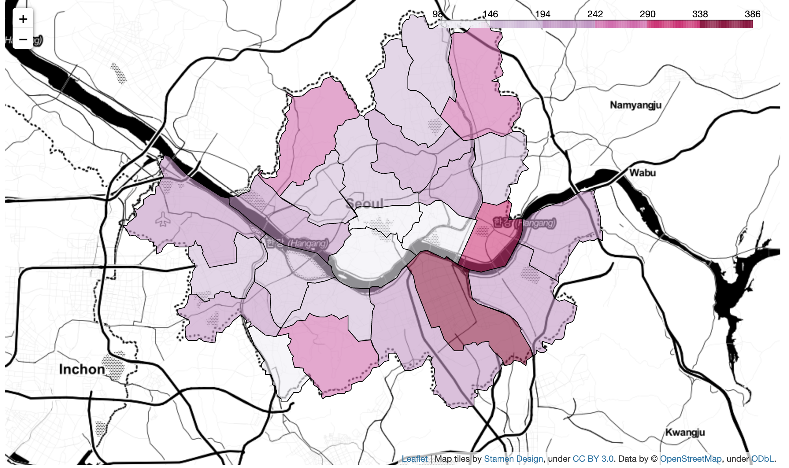
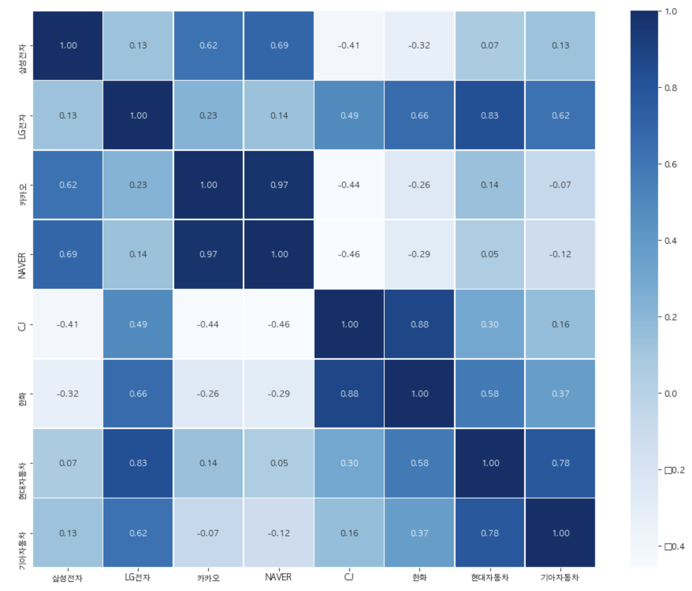

# Data Science - Python

This repository contains multiple data science projects that are built with
numpy, folium, seaborn, etc.

## 1. Chicken Run

Built with Pandas, NumPy, Matplotlib, and Folium, Chicken Run analyzes and
interprets provincial demand for Korean Friend Chicken in Seoul, South Korea.

Data is poured on an interactive map by providing geodata to folium's
Chloropleth visualizer.

```
folium.Choropleth(geo_data=geo_data,
                 data=gu_chicken_count,
                 columns=[gu_chicken_count.index, gu_chicken_count],
                 fill_color='PuRd',
                 key_on='feature.properties.name').add_to(map)
```



## 2. Beta Insight

Built with Panda,s Matplotlib, and Seaborn, Beta Insight decodes historical
prices of top performing securities in the Korean financial market. Beta
coefficients were translated then compared against stocks for correlation
visualization.

```
corp_name = "카카오"
condition = "corp=='{}'".format(corp_name)
kakao = code_result.query(condition)
kakao = kakao['code']
kakao = kakao.to_string(index=False)
kakao = kakao.strip()
kakao = kakao.rjust(6, "0")
kakao += ".KS"
kakao_code = kakao
```

```
kakao_stock = pdr.get_data_yahoo(kakao_code)
```

```
plt.figure(figsize=(16,13))
sns.heatmap(data=corr_data, annot=True, fmt="0.2f", linewidths=0.5, cmap='Blues')
```


